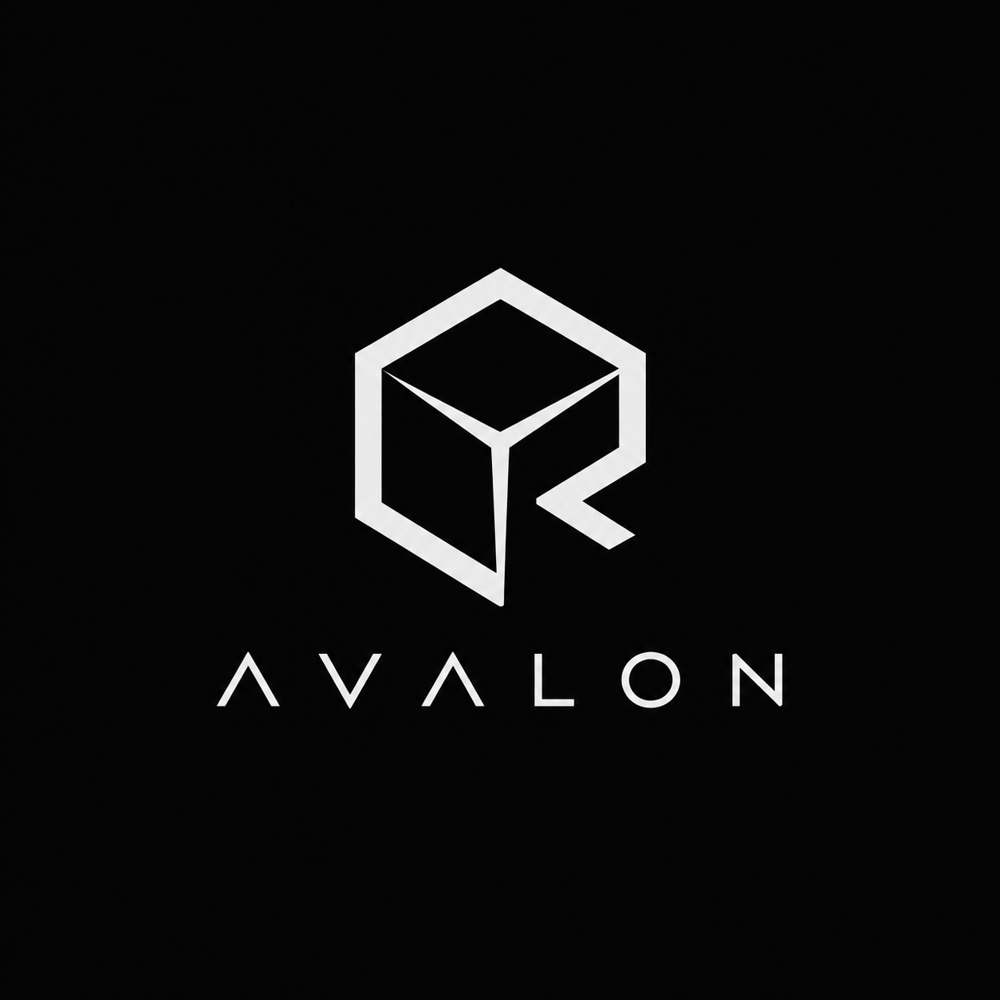

<p align="center">
  
</p>

# Avalon

Avalon is an experimental modern realtime rendering library written in C++20.
The project is designed as a place to explore current rendering architecture and
graphics techniques: realtime global illumination, GPU-driven rendering,
physically based materials, a full post-processing stack, and offline baking
systems for production-friendly performance.

The long-term goal is to provide a renderer that can scale from interactive
tools and viewers to larger realtime scenes, while still allowing expensive
lighting data to be baked ahead of time when that is the better tradeoff.

> Avalon is currently under active development. The repository is still in the
> foundation stage and does not yet include the full renderer described in the
> roadmap below.

## Planned Systems

- Render hardware interface and backend resource management.
- Render graph for organizing render passes and transient
  resources.
- Asset loading for meshes, materials, textures, and scene data.
- PBR material and lighting pipeline.
- Clustered light culling.
- GPU frustum/occlusion culling and indirect rendering.
- Realtime GI experiments.
- Shadow, reflection, and probe systems.
- Offline bake pipeline for static lighting and probe data.
- Post-processing stack.
- Renderer debugging views, GPU timings, and capture-friendly diagnostics.

## Building

Avalon uses CMake and C++20. Dependencies are fetched through CMake
`FetchContent`.

Requirements:

- CMake 4.2 or newer.
- A C++20 compiler.
- Platform graphics SDKs for the backends you plan to work on.
- Network access during the first configure step so CMake can fetch third-party
  dependencies.

Configure and build:

```powershell
cmake -S . -B build
cmake --build build
```

Build without the sample applications:

```powershell
cmake -S . -B build -DAV_BUILD_APPS=OFF
cmake --build build
```

When built as the top-level project, `AV_BUILD_APPS` defaults to `ON` and builds
the `AvalonSceneViewer` application.

## Using Avalon as a Library

Avalon can also be embedded in another CMake project. When used as a subproject,
`AV_BUILD_APPS` defaults to `OFF`, so only the library is built unless explicitly
enabled.

Using `FetchContent`:

```cmake
include(FetchContent)

FetchContent_Declare(
    Avalon
    GIT_REPOSITORY https://github.com/<owner>/Avalon.git
    GIT_TAG main
)

FetchContent_MakeAvailable(Avalon)

target_link_libraries(MyTarget PRIVATE Avalon)
```

Using a local checkout:

```cmake
add_subdirectory(path/to/Avalon)
target_link_libraries(MyTarget PRIVATE Avalon)
```

## License

Avalon is released under the [MIT License](LICENSE).
